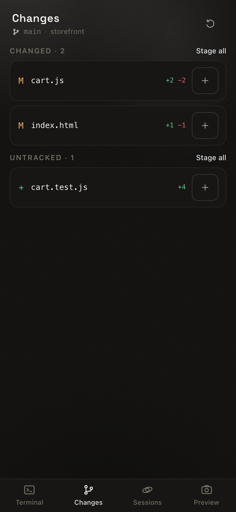

<p align="center">
  
</p>

<h1 align="center">Orbit</h1>

<p align="center">
  Your Mac or Windows PC as a personal AI dev server — driven from your phone.<br>
  A real terminal for Claude Code and Codex CLI, in an installable web app.
</p>

<p align="center">
  <a href="https://github.com/GA-MO/orbit/actions/workflows/ci.yml"></a>
  <a href="https://github.com/GA-MO/orbit/releases/latest"></a>
  
  
  <a href="LICENSE"></a>
</p>

<p align="center">
  <a href="https://ga-mo.github.io/orbit/">Website</a> ·
  <a href="docs/USER-GUIDE.md">User guide</a> ·
  <a href="docs/SETUP.md">Setup</a> ·
  <a href="docs/MCP.md">Agent integration</a> ·
  <a href="docs/TAILSCALE.md">Remote access</a> ·
  <a href="docs/DESIGN-NOTES.md">Design notes</a>
</p>

<p align="center">
  
  
  
</p>

## What it is

Coding agents live in a terminal on the machine you work at — a Mac or a
Windows PC. Orbit puts that terminal on your phone — over your own tailnet,
never the public internet — and adds the things a phone needs to actually
drive one: a key bar with Ctrl and arrows, voice input, a diff you can stage
and commit with a thumb, screenshots of the app under development, and a way
for the agent to reach *you* when it stops and waits.

It is a single-user, local-first tool. The machine is the source of truth; the
phone is a window onto it. Nothing runs in a cloud.

## Features

- **A real terminal.** xterm.js over a WebSocket to a PTY: colours, cursor
  movement, interactive prompts, Ctrl+C, resize. Sessions outlive the phone
  disconnecting and the server restarting; reconnecting replays the screen.
- **Agents as providers.** Claude Code, Codex CLI or a plain
  shell, started through your login shell so your PATH applies. Ended
  sessions resume as the same conversation; conversations you started at the
  desk show up on the phone too.
- **Words and pictures in.** Voice dictation (Thai and English), a photo
  dropped into the prompt as a path, press-and-hold to copy from the
  terminal, tap a URL to open it in a frame over the session.
- **Review what the agent wrote.** A Changes tab: status, per-file diffs with
  word-level marks, stage a hunk, commit, push.
- **Look at the running app.** Headless captures at phone, tablet and desktop
  sizes; the machine's own screen; a dev server published over the tailnet as
  https so it opens *inside* the app.
- **The agent's side.** An MCP server (`orbit_capture`, `orbit_screen`,
  `orbit_notify`, `orbit_ask`, `orbit_preview`) and Claude Code hooks that
  forward "waiting for you" moments — and, if you opt in, hold the agent's
  own dangerous commands until you tap Block or Run it on the phone.
- **Know which session wants you.** Per-session attention with a badge, a
  settled-agent detector for agents that cannot say so themselves, Web Push
  that reaches a locked phone, and answer buttons on the notification itself.
- **Installable.** A PWA with an offline shell; add it to the home screen.

## Install

One executable, no runtime to install. On macOS:

```sh
curl -fsSL https://raw.githubusercontent.com/GA-MO/orbit/main/install.sh | bash
```

On Windows, in PowerShell:

```powershell
irm https://raw.githubusercontent.com/GA-MO/orbit/main/install.ps1 | iex
```

That puts `orbit.exe` in `%USERPROFILE%\.orbit\bin` and adds the directory to
your user PATH; the macOS installer does the same with `~/.orbit/bin` and
`~/.zshrc`. Either way, open a new terminal afterwards.

Then, on the machine itself:

```sh
orbit doctor    # what this machine has and what it is missing
orbit setup     # wire the hooks and the MCP server into Claude Code
orbit start     # run it, published over your tailnet as https
```

`orbit stop` stops it again: it signals whatever holds the port, insists only
if it has to, and takes the tailnet front door down with it, so nothing is
left proxying to a port with nothing behind it.

`orbit start` prints the tailnet address and a QR code of it. Scan that with
your phone's camera, with Tailscale on, or open the address by hand. That is
the whole setup — nothing to pair, nothing to type, nothing that expires, and
the code never stops working. Tailscale puts a verified `Tailscale-User-Login` on
every request it proxies, and a request carrying the machine's own login is
served without a token at all. A different login is refused. Add it to the
home screen and it is the same walk-in from there.

That works because the server listens on `127.0.0.1` alone, so `tailscale
serve` is the only way in from another device. If you have no Tailscale —
not installed, not logged in, or HTTPS turned off in its admin console —
`orbit start` says which of those it is, starts the server anyway, and tells
you to re-run it as `orbit start --lan`. That binds every interface again and
prints the machine's Wi-Fi address, so a phone on the same network can open it.
On that path the login header is ignored entirely and the access token is the
only credential: scan the QR code the banner prints, or type the token beside
it. `orbit pair` prints a fresh code when the one on screen has expired.
Voice input and Add to Home Screen need real https, so Tailscale is still
worth setting up.

**Upgrading from 0.2.x?** The Wi-Fi address stops answering. `orbit start`
now listens on the machine itself and reaches your phone over Tailscale; pass
`--lan` (or set `ORBIT_LAN=1`) to get the old behaviour back.

Later on, `orbit update` replaces that executable with the latest release —
`orbit update --check` says what is out without touching anything, and `orbit
doctor` mentions a newer release when it sees one. From a checkout it is `git
pull && make setup` instead, and `orbit update` says so rather than
overwriting anything.

**Requirements**

| | |
|---|---|
| macOS or Windows | Apple silicon or Intel on the Mac; x64 on Windows. Bun compiles no Windows ARM target, so an ARM Windows machine runs the x64 build under emulation. Linux is not supported |
| [Tailscale](https://tailscale.com) | how a phone reaches the machine at all, and who it says you are — with real https (voice and Add to Home Screen need it). Without it, `orbit start --lan` and the access token |
| [Claude Code](https://docs.anthropic.com/en/docs/claude-code), Codex CLI | whichever you use — Orbit finds what is on your PATH |
| Google Chrome | optional, for captures of the app under development |

Both installers take `ORBIT_VERSION=v0.2.0`, `ORBIT_INSTALL_DIR` and
`ORBIT_NO_MODIFY_PATH`, and verify the release's checksum and refuse a
download that does not match.

## How it works

```
  phone (PWA)  ──https, tailnet only──▶  orbit  ──bun-pty──▶  zsh -l / pwsh  ──▶  claude / codex
       ▲                                  │                                       │
       │   notices, questions, push       │◀────── MCP tools + hooks ─────────────┘
       └──────────────────────────────────┘
```

- **Server:** Bun + TypeScript. HTTP, WebSocket, PTY sessions, git, headless
  Chrome, push notifications. One executable with the web app inside it.
  Everything the two operating systems do differently — the login shell, the
  screen capture, which ports are listening, where Chrome and the Tailscale CLI
  live — sits behind one interface in `server/src/platform`, with a `darwin`
  and a `win32` implementation of it.
- **Web:** React, Vite, xterm.js, Tailwind. Mobile first; the touch handling
  is tested on both Chromium and WebKit.
- **Security:** the server binds `127.0.0.1`, so the only way in from another
  device is `tailscale serve` — which is what makes the login header it adds
  worth trusting, and Tailscale's own documentation names that as the
  condition. A request whose `Tailscale-User-Login` is the machine's own login
  is let in; a foreign login, or a foreign `Origin`, is not. The bearer token is
  still there for the MCP server, the hooks and `orbit pair` over loopback,
  and it is the only credential under `--lan`, where the header is ignored.
  An `HttpOnly` hashed cookie covers what a header cannot reach (the socket,
  images); nothing in URLs; slow rejection of guesses; commands matching
  dangerous patterns held for approval whether you typed them or the agent
  did. `tailscale serve` is tailnet-only — Orbit never uses `funnel`.

The reasoning behind each piece — what was tried first, which failure each
decision prevents — is in [docs/DESIGN-NOTES.md](docs/DESIGN-NOTES.md).

## From source

Needs [Bun](https://bun.sh) 1.4 or newer.

```sh
git clone https://github.com/GA-MO/orbit && cd orbit
make install    # bun install
make setup      # build, register the MCP server, install the hooks
make start      # run on :7788, published over the tailnet
```

```sh
make dev        # Vite on :5173 with HMR, server on :7788
make dist       # one executable → dist/orbit  (TARGETS=all for both Macs and Windows x64)
make doctor     # the same check the installed binary offers
make stop       # stop the server and the tailnet front door
```

`make` is a macOS convenience. On Windows the same steps are the commands it
wraps: `bun install`, `bun run build`, then `bun server/dist/main.js setup`,
`… start`, `… doctor` and `… stop`; `bun run dev` is `make dev`. The
`remote:*` and `preview:*` scripts in `package.json` are shell one-liners and
run on macOS only — on Windows call `tailscale serve` yourself, or let the
Preview tab do it.

`orbit setup` resolves every path from whatever is running it, so nothing is
copied by hand; it replaces its own hooks rather than adding a second copy,
backs up `~/.claude/settings.json` first, and `make unsetup` takes it all
back out.

## Testing

```sh
make test               # every suite, against a throwaway server
make test-smoke         # API, MCP, hooks (no browser)
make test-touch         # touch behaviour in Chromium (ENGINE=webkit for WebKit)
make test-changes       # the Changes tab in a real browser
make test-install       # the installer, against a stand-in release
```

The runner is `bun scripts/test.ts <suite>`, which runs on both platforms;
`bash scripts/test.sh <suite>` is a thin shim onto it, and the `make` targets
above are a macOS convenience over the same thing. It builds, starts an Orbit
of its own on the first free port from `:3099` under a scratch `HOME`, runs the
suites and takes it down — a run can neither be coloured by the last one nor
reach the `~/.orbit` you use. `ORBIT_BIN=dist/orbit` runs the suites against
the compiled executable. `tailscale` is a stand-in in the tests
(`scripts/fake-tailscale.mjs`).

CI runs the typecheck, the build, `bun audit` and every suite on both macOS
and Windows on each push. A tag `v<version>` (`scripts/release.sh 0.2.0`)
builds each executable on the system it runs on, starts it there, and
publishes them as a release with checksums — see
[Releasing](docs/SETUP.md#releasing) in the setup guide.

## Documentation

- [User guide](docs/USER-GUIDE.md) — every tab, gesture and feature, with screenshots
- [Setup](docs/SETUP.md) — a machine from scratch, what `orbit setup` writes, troubleshooting
- [Agent integration](docs/MCP.md) — the MCP tools and the hooks, from the agent's side
- [Remote access](docs/TAILSCALE.md) — Tailscale, https, running at login, security
- [Design notes](docs/DESIGN-NOTES.md) — why each piece is shaped the way it is
- [Website](https://ga-mo.github.io/orbit/) — the product page

## Status

Everything above is built and tested. Still open: a file browser, a session
timeline, a tablet layout, and tying captures to the session that asked for
them. The original brief is kept in [docs/archive/original-brief.md](docs/archive/original-brief.md).

## License

[MIT](LICENSE).
