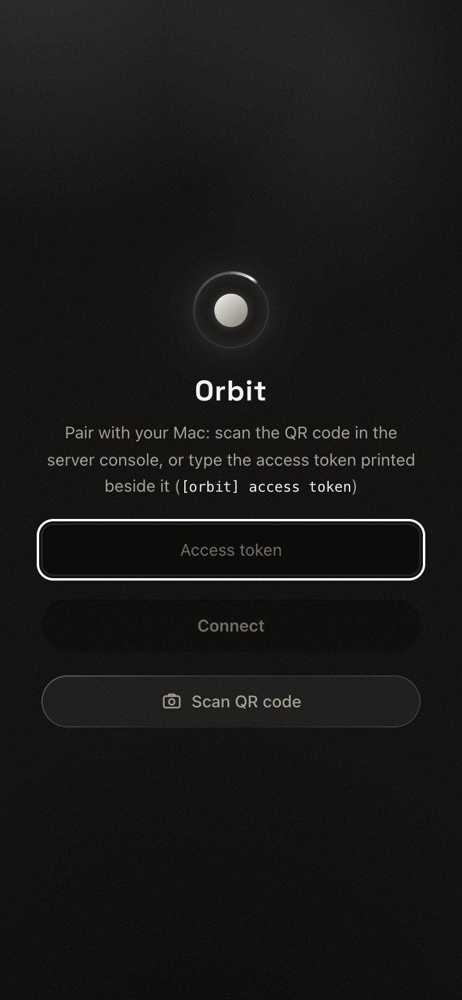
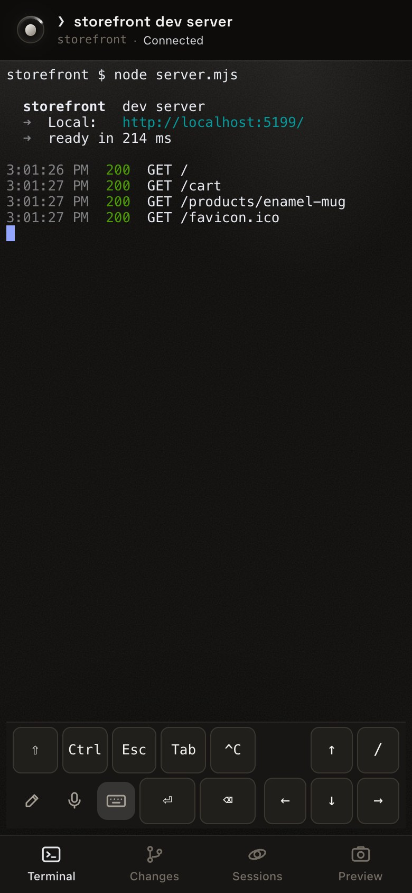
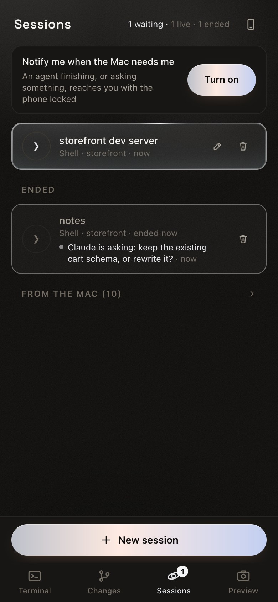
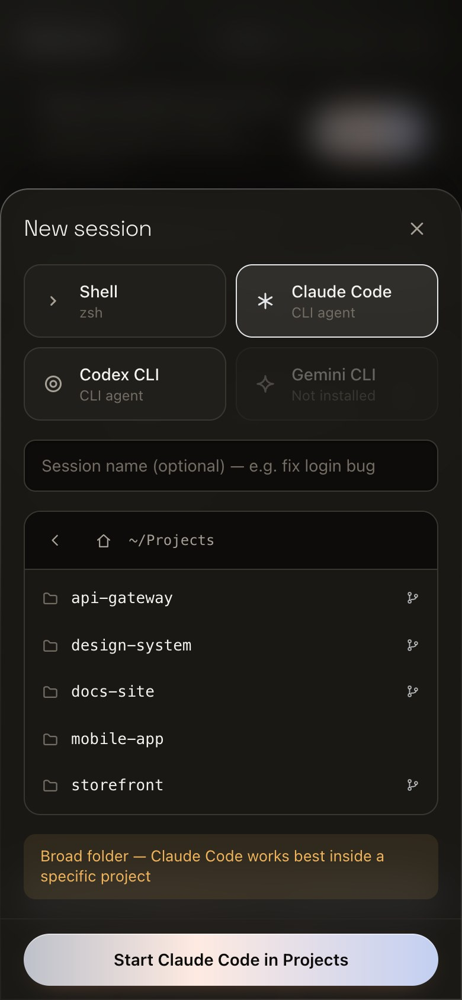
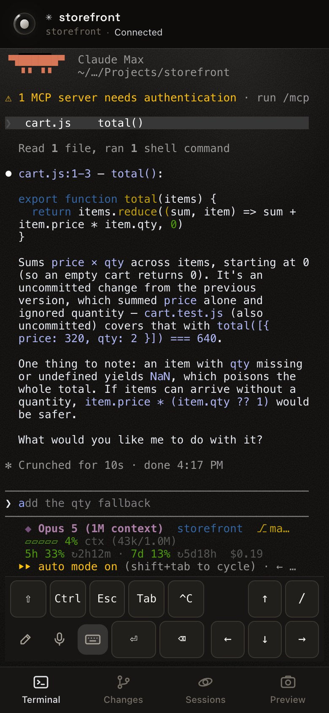
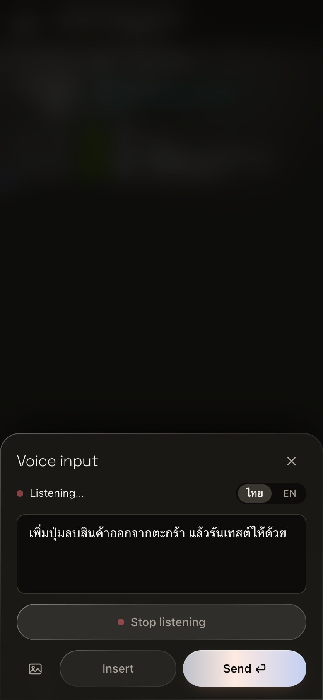
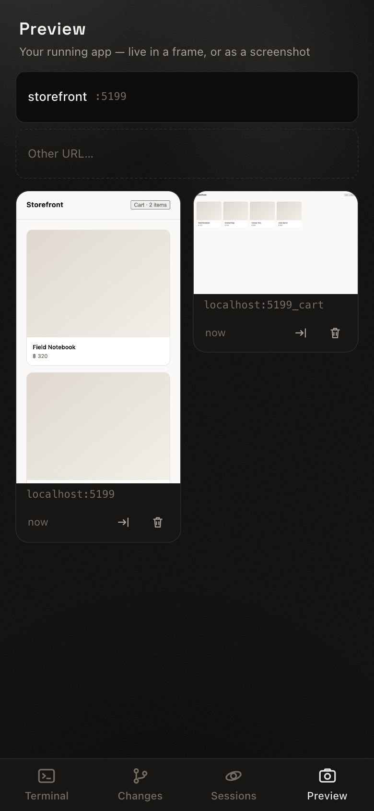
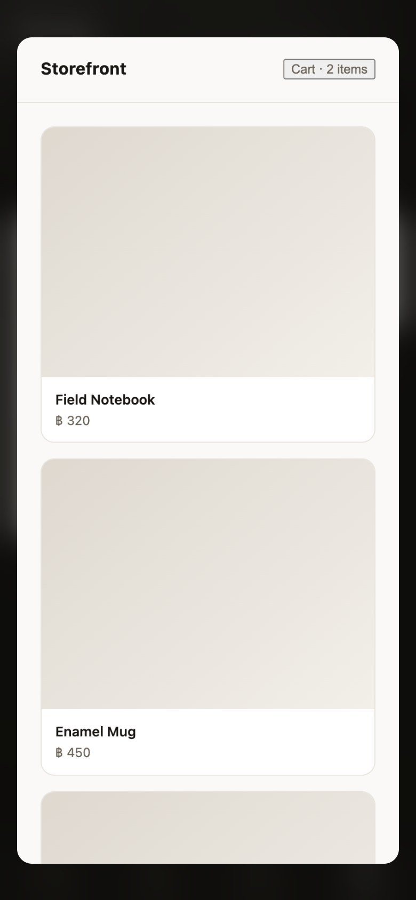
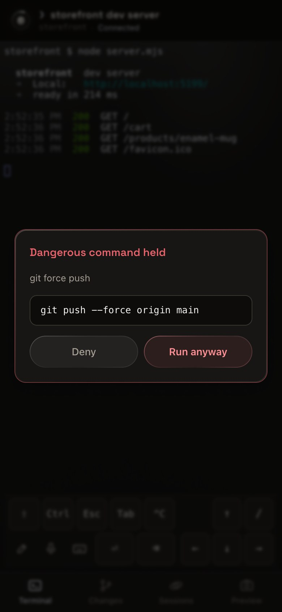
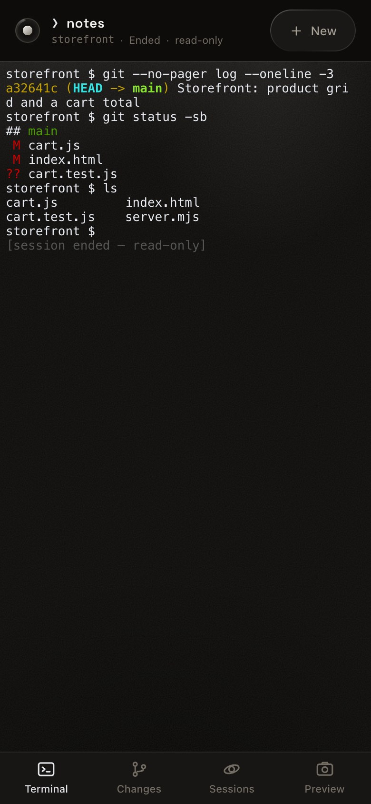

# Orbit user guide

Orbit turns your MacBook into a personal AI development server: you drive Claude Code from your phone as if you were sitting at the machine. This guide walks through every feature with a worked example — building a small demo website, running its dev server, checking the result with screenshots, and talking to Claude Code — all from a phone screen.

> All screenshots were taken in real use at an iPhone-sized viewport (390×844).

## Contents

- [Getting started: open it on your phone](#getting-started-open-it-on-your-phone)
- [The Terminal tab](#the-terminal-tab)
- [The Changes tab](#the-changes-tab)
- [The Sessions tab](#the-sessions-tab)
- [Starting a session](#starting-a-session)
- [Claude Code from your phone](#claude-code-from-your-phone)
- [Voice input](#voice-input)
- [Sending images](#sending-images)
- [The Preview tab](#the-preview-tab)
- [Letting the agent act (MCP)](#letting-the-agent-act-mcp)
- [Command approval](#command-approval)
- [Ended sessions](#ended-sessions)
- [Install as an app (PWA)](#install-as-an-app-pwa)
- [Everyday flows](#everyday-flows)

## Getting started: open it on your phone

Orbit is a single executable. Install it on the Mac:

```sh
curl -fsSL https://raw.githubusercontent.com/GA-MO/orbit/main/install.sh | bash
```

Then run `orbit start` (from a source checkout, `make start`). It prints an
address, `https://<machine>.<tailnet>.ts.net`, and a QR code of that address.
**Point your phone's camera at it**, with the Tailscale VPN on, or type the
address if you prefer. You are in — no pairing, nothing to type, nothing that
expires, and the code works as often as you like.

Tailscale is what makes that safe: the server listens on the Mac itself only,
so the tailnet is the way in, and Tailscale tells Orbit which account is
calling. If it is your Mac's own account, you are let in. Anyone else is not.

### Adding it to the Home Screen just works

The home-screen app gets storage of its own, separate from Safari (an iOS
limitation), but there is no longer anything stored to carry over. Add it and
open it; it walks in the same way.

### If you have no Tailscale

`orbit start` says so in a line, runs the server anyway, and tells you to
re-run it as `orbit start --lan`. That opens the Mac's Wi-Fi address so a phone
on the same network can reach it — and on that path Orbit cannot tell who is
calling, so it asks for the access token instead. Scan the QR code the Mac
prints, or type the token beside it (`[orbit] access token: …`); `orbit pair`
prints a fresh code when the one on screen has expired.

That gets you the terminal. Voice input and Add to Home Screen need real https,
so see [TAILSCALE.md](TAILSCALE.md) when you want those.

### Two ways in

| Route | URL | Limits |
|---|---|---|
| **HTTPS over Tailscale** (recommended) | `https://<machine>.<tailnet>.ts.net` | Every feature works, it works away from home, and there is nothing to sign in with. One-time setup in [TAILSCALE.md](TAILSCALE.md). |
| Wi-Fi, with `orbit start --lan` | `http://<mac-ip>:7788` | Phone and Mac must be on the same Wi-Fi, the access token is asked for, and **voice input and Add to Home Screen do not work**. |

Voice does not work over plain HTTP because the browser only grants the microphone and registers service workers on a secure context (HTTPS). This is a browser rule, not an Orbit limitation.

The login screen below belongs to the `--lan` route. On the Tailscale route it
never appears — nothing is drawn until the server has answered, so no field
flashes past on the way in.



## The Terminal tab

Once you are in, you see a terminal connected directly to zsh on the Mac. ANSI colors, your prompt theme, Ctrl+C and interactive TUIs all work. The header shows which session you are in, its folder, and the connection state (a spinning Orbit ring means connected).

In the screenshot: creating an `orbit-demo` project, writing `index.html`, and running `python3 -m http.server 4321` — all typed on the phone.



> 💡 **Sessions survive the screen going dark.** Close the browser, switch apps, or lose the network; when you come back, the shell is still running with its full history.

> 🔄 What you see on screen is the last frame the agent drew. Full-screen apps such as Claude Code only repaint when the screen size changes, so every time you return to the app, Orbit asks for a repaint on your behalf. This is also why the key bar stays open all the time and no longer has a collapse button: collapsing it is a resize, and if that resize lands while the agent is mid-draw, the whole input box disappears.

### The key bar

The bar below the terminal holds the keys a soft keyboard lacks, in two fixed rows.

| Key | What it does |
|---|---|
| **⇧** | Shift for the next key. Tab becomes Shift+Tab, `/` becomes `?`, arrows send Shift+arrow. |
| **Ctrl** | Ctrl for the next key. The letter comes from the soft keyboard, so tapping Ctrl opens it if it is closed. Ctrl+⌫ deletes a word; Ctrl+arrow moves by word. |
| **Esc**, **Tab**, **^C** | Escape, Tab, and Ctrl+C. |
| **⏎**, **⌫**, **/** | Enter, Backspace (hold to repeat), and slash — the character every skill starts with, which iOS hides behind the number switch. |
| **↑ ← ↓ →** | Arrow keys in the inverted-T layout of a real keyboard. Hold to repeat. |

Ctrl and Shift work like Shift on the iOS keyboard: tap once and the modifier applies to the next key only; tap again and it **locks** until you tap it off. The key is tinted while armed and solid while locked.

Three buttons sit in the same bar: ✎ opens the Message sheet for writing a whole message before sending it (it is highlighted while an unsent draft is waiting), 🎤 opens voice input, and ⌨️ shows or hides the keyboard.

### Copy text and tap links

The terminal draws its own characters, so iOS offers no selection handles the way it does for ordinary text. Orbit adds two gestures of its own.

**Tap a URL** and a sheet asks what to do with it, with two buttons:

- **Open here** opens the page in a frame over the terminal. You never leave the app, and the session keeps running behind it.
- **Copy** puts the URL on the clipboard.

There is deliberately no button that hands the URL to the browser. Leaving and coming back makes iOS reload the whole app, and from a Home Screen icon there is no second tab for WebKit to send a same-host URL to, so it would drag the whole app to that page instead. If you really want the page in the browser, **Copy** it and paste it there.

A **plain http** link cannot be opened in the frame: Orbit is served over https and the browser blocks mixed content. The sheet then offers only **Copy** and says why. To make such links openable, put the dev server on https with `bun run preview:on`.

Some details worth knowing:

- A URL that wraps onto the next line is still one link — including when the **program wrapped it itself**, as Claude Code does when it indents continuation lines by two spaces. A trailing comma is not counted as part of the link.
- **`localhost` is rewritten to point at the Mac.** When the agent prints `http://localhost:5173`, it means the Mac, but opened as-is on the phone it would mean the phone. On tap, Orbit swaps the host for the one you are using to reach Orbit, keeping the port. This works because Vite binds every interface.

**Press and hold** to select the **word** under your finger. Words are split at whitespace only, so a long path such as `~/Development/orbit/web/src/Terminal.tsx` comes as one piece rather than being cut at each `/`. From there you can adjust the selection three ways:

| Gesture | Effect |
|---|---|
| Drag either round grip | Grow or shrink the selection one character at a time. Dragging past the right edge flows onto the next line. |
| Keep dragging without lifting your finger | Extend from the first word outward. |
| **Line** button in the bottom bar | Select the whole line. A line that wraps counts as one line. |

Then tap **Copy**. Tap anywhere else once to cancel. The counter in the bar shows how many characters you are holding (or how many lines, for a whole-line selection).

Empty space below the text cannot be selected: pressing and holding there does nothing, and dragging past the last line stops at the last line that has characters.

> ⚠️ The Copy button uses the browser clipboard, which is **blocked on plain HTTP**. Over Tailscale (HTTPS) it works fully; on the LAN it falls back to a method some devices do not support.

### Paste into the terminal

You cannot press and hold on the prompt and choose Paste: the characters in the terminal are drawn, not an input field iOS recognizes. Use the **clipboard button in the header** instead.

- Over **Tailscale (HTTPS)**, iOS shows a **Paste** button to confirm once, and the text lands at the prompt.
- Over **plain HTTP**, the browser will not let the page read the clipboard, so Orbit opens a sheet with a text field. Press and hold there, choose **Paste**, then tap **Insert** (or **Send ⏎** to send it straight away).

Multi-line text goes in as a single block. The first line is not fired off on its own, as it would be if you typed Enter yourself.

## The Changes tab

The Terminal shows what the agent **is doing**. This tab shows what it **has written** — which used to mean typing `git diff` in a terminal on a 390px screen and squinting at the result.

The tab follows the folder of the open session. If that folder is a git repository, you see:

- **The branch** in the heading, with ↑ (commits the remote does not have yet) and ↓ (commits you are behind).
- **The file list, grouped into Staged, Changed, and Untracked.** Each row shows a status letter (M modified, A added, D deleted, R renamed) and a line count such as `+3 −2`.
- **Tap a row to read the diff** full screen. Added lines are green, removed lines red. Long lines scroll sideways rather than wrapping, because a wrapped diff hides which column the `+` is in. Untracked files have a diff to read too.
- **The ＋ / − button at the end of a row** stages or unstages that file. **Stage all** does a whole group at once.

Once something is staged, a commit message field appears at the bottom. Type the message and tap **Commit N files**. What goes into the commit is exactly what is in the Staged group — there is no `-a` quietly sweeping up files you did not pick. A toast confirms the commit with its sha and line counts.

**Push** appears only when tapping it would actually do something: there are unpushed commits, or the branch has never been pushed (in which case Orbit adds `--set-upstream` itself, since nobody is there to answer git's question). A repository with no remote does not show the button at all.

> Nobody can type a password for git here, so the server tells git not to ask (`GIT_TERMINAL_PROMPT=0`) and shows you git's actual message instead of hanging on a prompt.

## The Sessions tab

Every session in one place. A blinking yellow dot means the session is running. Each row shows the agent, the folder, and the age. Name a session with ✎ to tell them apart — "demo server" and "demo feature", say.

Unnamed sessions are still telling: **the first thing typed into a session becomes its name** (the first command for a shell, the first prompt for an agent). It is shown in monospace so you can see it is not a name you chose. Naming the session with ✎ replaces it immediately.



### Which session is waiting for you

An agent that stopped to ask something used to send one toast that vanished after three seconds; miss it and it was gone. Now **each session's last message stays until you have read it.**

- **The number on the Sessions tab icon** is how many sessions have something pending. Solid blue means at least one of them is **waiting for an answer**, not merely finished.
- **The row shows the message itself**, for example "Claude is asking: switch the JWT library? — Yes / No · 4m", with a blinking blue dot if it is waiting.
- **A toast from another session** carries an **Open** button. Tap it to jump straight there instead of hunting through the list.
- **Opening the session counts as reading it.** That is what clears the badge — simply opening the app does not.

The same bookkeeping means **a notification tapped on the lock screen takes you to the session that sent it**, not whichever session happened to be open last.

> A "finished" message never overwrites a pending "waiting for an answer". Claude asks and then ends its turn, in that order; if the later message won, the row would say "done" while the question is still unanswered.

### Even when the agent says nothing

Everything above depends on the agent **choosing to speak**, through MCP (`orbit_notify`) or through Claude Code hooks, which have to be set up first. Codex, Gemini, and a Claude without hooks have neither, so they used to sit at "Do you want to proceed?" while the phone stayed silent.

Now Orbit **watches the screen itself.** A working agent is an agent that is drawing — a spinner, a timer, tool output. If nothing has been drawn for 10 seconds, the frame is complete and the cursor is waiting at the input box. The row gets a badge on its own, with the last readable line from the screen (a line ending in `?` is preferred, since what it stopped for usually sits just above the input box).

- This applies to **agent sessions only.** A shell sitting at its prompt is silent by nature; counting it would badge every row and mean nothing.
- **What the agent says itself always wins.** If it has already said what it is waiting for, Orbit's guess from the screen does not overwrite it. A guessed badge is **dimmed, with a dot that does not blink**, so you can tell a real message from a screen reading.
- If **no phone is connected** at the time, you get a push notification: `<session name> is waiting`.
- If you are **looking at that session** at the time, nothing happens — the screen it read is the one in front of you.

### Row actions

| Control | Effect |
|---|---|
| Tap the row | Switch to that session |
| ✎ | Rename |
| ✕ (running session) | Stop it. The history is kept under Ended. |
| ＋ (ended session) | Start it again with the same agent, folder, and name; an agent resumes as the same conversation |
| ✕ (ended session) | Forget it, history included |

## Starting a session

Tap **+** in the Sessions tab.

1. **Pick an agent.** A card is dimmed if that CLI is not installed.
2. **Name it** — optional, but a great help once several are open.
3. **Pick the project folder.** Recent projects are one tap away, or browse. Folders that are git repositories carry a green branch mark, and a filter field appears when there are many folders. Picking something broad like your home folder shows a yellow warning, but it is not blocked.



## Claude Code from your phone

Choose the Claude Code card and a project folder, and you get the real Claude Code running on the Mac. In the screenshot: the "demo feature" session in `orbit-demo`, switching models with `/model haiku` and sending a test prompt. The reply comes back to the phone in full.



## Voice input

Tap the microphone 🎤 in the bottom key bar (the same row as the pencil ✎ and the keyboard ⌨️ buttons), speak, and the transcript appears as you go. **You can edit the text before sending it.**

> ⚠️ Requires **HTTPS**. Opened as `http://<mac-ip>:7788` (the `--lan` route), the browser refuses to grant the microphone. See [TAILSCALE.md](TAILSCALE.md).

- **Continue listening** — the full-width button under the transcript. iOS stops listening at every pause; tap this to keep speaking, and the text so far is kept. While listening, the same button reads **Stop listening**.
- **The image button 📷** — upload a picture and its path is appended to the transcript, without going back to the pencil.
- **Insert** — hands the transcript to the Message sheet (the pencil button), where you can edit or keep typing before you send it yourself.
- **Send ⏎** — types it into the terminal and sends it immediately.



### On iPhone

iOS does not transcribe on the device. Speech goes to **Apple's dictation service**, which brings limits that Android and Chrome do not have.

- **Choose the language before you speak.** The **ไทย / EN** toggle in the top-right corner of the dictation sheet listens for one language at a time; set to EN and speaking Thai gives garbage. You can switch mid-way (listening restarts and the text so far is kept), but **Thai and English mixed in one sentence does not work.** For technical terms such as `bun run build`, say the instruction in Thai and type the code part into the transcript yourself.
- **It listens in stretches.** After a moment of silence iOS closes the session and the status changes to "Stopped". Tap **Continue listening** to go on; the new text is appended to what you have.
- **Three switches must all be on.** Any one of them off gives the same `service-not-allowed` error, which cannot be told apart from the others, so check all three and then **reload the page**:
  1. Settings › Privacy & Security › **Speech Recognition** › Safari — on
  2. Settings › General › Keyboard › **Enable Dictation** — on
  3. In Safari, tap **"AA"** in the address bar › Website Settings › **Microphone** › Allow

  (With Screen Time enabled, also check Content & Privacy › **Siri & Dictation**.)
- **Not from the Home Screen icon.** WebKit blocks speech recognition in a standalone PWA. Open Orbit in Safari instead.
- **Needs internet.** Dictation goes through Apple's servers; a Tailscale connection alone is not enough.

## Sending images

Tap the image button in the header, then pick a photo or take one (a screenshot of an error, or a design you want built). The file is uploaded to the Mac and **its path is typed into the terminal for you** — carry on typing what you want Claude to do with it.

## The Preview tab

The agent says it fixed the page. What does it look like now? The Preview tab
answers that without leaving the phone.

The tab is a list of **ports serving a web page on the Mac right now**, one row
per port, with the program holding it and the project it belongs to
(`:5173 node`, `:8899 Python`). Each row carries everything that port can do:
open it live, capture it, share it, stop sharing it.

### Capture a screenshot

Tap the capture button (⧉) on a row. A sheet asks for a size:

| Choice | What you get |
|---|---|
| **Phone** / **Tablet** / **Desktop** | The page at that viewport width |
| **Full page** | The page at the phone's width, with the height allowed to run past the fold |

The Mac opens headless Chrome, renders the page and files the image in the
gallery below at its real aspect ratio, so a desktop shot is not cropped to a
phone shape.

If the dev server is not running, you get an error that says so. Orbit does
not save Chrome's own "cannot connect" page and present it as a success.

Every image in the gallery is labeled with what it is (`localhost:5173`), not
only when it was taken.

In the screenshot: the `orbit-demo` page that was just built through the
terminal.



Tap an image to view it full screen. **⇥** inserts the image path into the
terminal so the agent can look at it ("why is the button off-center — see this
image"). **🗑** deletes it.

### Try it, not just a picture

A still image is not the same as pressing the buttons. Tap the body of a row
and the app running on the Mac opens **live, inside Orbit**: tap, fill in
forms, scroll, all of it.

Under the hood this is one gesture with two steps. A port that is only
listening is first **shared over https** on the tailnet (the row reads "Share
:5173 over https and open it"), then opened in a frame. A port that is already
shared opens straight away, at the route you left it on last time.

Why https? Orbit itself is served over https, and an installed web app may only
frame a page that is a secure context too. Plain http from `localhost` cannot
load inside it. Sharing also gives the app under test everything it needs from a
secure context of its own: service workers, the microphone, the camera.

Each shared port gets an https port of its own on the tailnet, starting at
`8443` and counting up (`https://<mac>.<tailnet>.ts.net:8443`). It is
tailnet-only; nothing is exposed to the public internet. It does not touch
Orbit's own `tailscale serve` mapping (443 → 7788) — different ports, switched
on and off independently. **Stop sharing :5173** on the row takes it down
again.

The agent can do the same thing with the MCP tool `orbit_preview` (see
[MCP.md](MCP.md)), so "share the dev server and open it for me" is a sentence
you can type into the terminal.

If you need to publish from the Mac's own terminal instead, a checkout has a
fallback:

```sh
bun run preview:on                     # port 5173 at https://<mac>.<tailnet>.ts.net:8443
PREVIEW_PORT=3000 bun run preview:on   # a dev server on another port
bun run preview:off                    # stop sharing
```

The Preview tab is the normal path; these commands are for when the phone is
not to hand.



### No port to type

You never type `http://localhost:5173` on a phone keyboard. The rows in the
Preview tab are the ports that are serving a web page **right now**, and each
one is labeled with the program that holds it.

Orbit asks `lsof` what is listening and then filters in three passes:

1. Drop the ranges that are not yours: ephemeral ports the system hands out
   (32768 and up) and ports that need root (below 1024).
2. Drop the macOS services that sit on popular ports (Control Center holds
   5000 and 7000).
3. **Make one real HTTP request.** Databases and agent processes fall out here.

On the Mac this guide was written on, that took 13 listening ports down to 1.

The list is refreshed when you open the tab and when you come back from the
lock screen. It does not poll. If the agent has just started a dev server,
switch away from the tab and back.

For a page that is not on this Mac — a staging site, say — the **Other URL**
row takes a full address and captures it the same way. Only a port on this Mac
can be shared over https; a remote URL can be captured but not framed.

### The Mac's screen belongs to the agent now

The **Mac screen** switch is gone from this tab. Whoever is holding the phone
is, by definition, not looking at the Mac's display.

The capability is still there; it moved to the agent's side. Ask for
`orbit_screen` through MCP (see [MCP.md](MCP.md)) and the agent sees the iOS
Simulator, Xcode, native apps, Figma — whatever is on the Mac's screen. The
image still lands in your gallery, labeled **Mac screen**.

This needs **Screen Recording** permission for the app that runs the Orbit
server (Terminal, iTerm, VS Code). The trap: without the permission, macOS
**does not raise an error**. It returns an empty desktop with no application
windows on it. When you see that, grant the permission at System Settings →
Privacy & Security → Screen & System Audio Recording.

## Letting the agent act (MCP)

`orbit setup` (from a checkout, `make setup`) registers Orbit's MCP server,
`orbit mcp`, with Claude Code. After that the agent can use the phone-side
features itself instead of waiting for you — and when it captures a page it
**sees the image**, not only a file path.

> "Capture http://localhost:5173 at desktop size and tell me where the layout
> breaks."

| Tool | What it does |
|---|---|
| `orbit_capture` | Capture a URL with headless Chrome at a chosen viewport; the image also appears in your Preview tab |
| `orbit_screen` | Photograph the Mac's own screen — Simulator, Xcode, native apps |
| `orbit_notify` | Send a notice to the phone, for instance when a long task is done |
| `orbit_ask` | Ask you a question with options, and wait for the answer before continuing |
| `orbit_preview` | Share a dev server port over https on the tailnet and open it in the app |

A question from `orbit_ask` appears as a dialog on the phone. The agent stops
until you pick an option. Details of every tool are in [MCP.md](MCP.md).

### Notifications on a locked phone

Open the Sessions tab. At the top is a row that reads **"Notify me when the
Mac needs me"**. Tap **Turn on** once.

Two conditions apply, both imposed by iOS:

- You have to tap. A web page may not request this permission on its own when
  it loads.
- It only works from the **installed app** — Orbit added to the home screen
  (see [Install as an app](#install-as-an-app-pwa)). Safari itself will not
  grant it.

From then on, a notice that arrives while the phone is locked or the app is
closed becomes a **system notification**, not a toast. It travels over Web
Push, which wakes the service worker even when the app is not running. While
the app is open in front of you, you get the toast only; the same event is not
delivered twice.

Without push you still miss nothing. A notice sent while nobody is connected is
held and **delivered the moment you open the app again**. The queue keeps the
last 10, for up to 6 hours.

### Answer from the notification

An `orbit_ask` that arrives while the app is closed carries the question's
**first two options as buttons on the banner** (Allow / Deny, say). On a
platform that shows notification actions, you answer from the lock screen —
no unlocking, no opening the app, no waiting for the socket to reconnect. The
agent on the Mac gets the answer at once.

- A question with more than two options continues in the app. **Tap the
  banner itself**, not a button, and the question opens there.
- On a platform that does not show buttons on notifications — **iOS is one** —
  tapping the banner opens the question in the app, exactly as before.
- If the Mac cannot be reached when you tap a button (asleep, off the tailnet),
  a banner tells you the answer was not delivered. It does not fail silently.
- The buttons **do not carry your account token**. Each carries a single-use
  ticket for that one question. It can answer only with the options the
  question declared, and it expires with the question.

## Command approval

There are two gates, for two sources of commands.

### What you send

Input that arrives as a block — a paste, or a voice transcript — is checked
against a list of dangerous patterns. On a match the command is **held**, and
a dialog shows the full text for you to read.



**Deny** discards it; nothing reaches the shell. **Run anyway** lets it
through. Characters typed one at a time are not checked — your hands, your
responsibility.

### What the agent runs

This gate sees only what **you** send. A command the **agent** runs through
its own Bash tool never passes through it. To cover that side, `orbit setup`
installs the hook `orbit hook approve` into Claude Code. From then on a
dangerous command the agent wants to run is **sent to your phone as a
question**, and the agent stops until you answer — from the app, or from the
buttons on the notification.

The hook behaves as follows.

| Situation | Result |
|---|---|
| Orbit is not running | The hook stays out of the way; this is a plain Claude Code session |
| A phone is connected, you answer | Your answer is the decision |
| A phone is connected, nobody answers within 180 s | Denied |
| No phone connected and no push subscription | Denied, within about 5 s, so the agent is not left hanging |

That is: it fails open when Orbit is absent, and closed when Orbit is present
and nobody says yes. The denial tells the agent to ask you directly.

The patterns both gates look for:

| Pattern | Examples |
|---|---|
| Recursive delete | `rm -rf` |
| Privilege escalation | `sudo` |
| Formatting a disk | `mkfs`, `diskutil erase` |
| Writing to a raw device | `dd of=/dev/…`, redirects into `/dev/…` |
| Power state | `shutdown`, `reboot`, `halt` |
| Rewriting shared history | `git push --force` |
| A fork bomb | `:(){ :|:& };:` |
| Opening up a root path | `chmod 777` on `/`, `/usr`, and the like |
| Removing launch services | `launchctl unload`, `launchctl remove` |

## Ended sessions

A session that has ended — the agent exited, you stopped it, or the server
restarted — can still be opened. The terminal shows the whole history
**read-only**, with a label in the header saying so. The key bar hides itself,
since there is no PTY to send anything to. Scrolling works as usual.

Orbit keeps the 20 most recent ended sessions.

To pick the work back up, two buttons sit at the top right of the terminal:

- **↻ Resume** reopens the **same conversation**. For Claude Code, Orbit
  remembers the conversation id and launches `claude --resume <id>`, so a
  folder's third-newest session is as reachable as its newest, and the same
  conversation is never open in two places at once.

  Codex has no such handle. `codex resume --last` reopens the **newest
  conversation in the folder**, so for Codex the button appears only on the
  most recently ended session of that folder and agent, and only while nothing
  is still running there — otherwise it would either promise a conversation it
  cannot reach or put a second agent into one that is already being held.
  Shell and Gemini have no resume command and no button.
- **＋ New** starts over: same agent, same folder, same name, no history.

The same ↻ and ＋ appear on ended rows in the Sessions tab.



### Conversations from the desk

Claude Code conversations you started in a terminal on the Mac itself appear in
the same list, so the afternoon's work at the desk is there on the phone in the
evening. They are read-only records, and they are not Orbit's to delete: the
✕ on such a row is **Hide from this phone**, not a delete. The conversation
stays where it is, and `claude --resume` at the desk still finds it. A hidden
row can be brought back from the same tab. Orbit's own ended sessions have
**Forget** instead, which deletes the history.

## Install as an app (PWA)

Open Orbit over https (see [TAILSCALE.md](TAILSCALE.md)), then in Safari use
the share sheet → **Add to Home Screen**. You get an Orbit icon on the home
screen that opens full screen, with no browser chrome.

The installed app has **storage of its own**, separate from Safari's, but over
Tailscale there is nothing to sign in with, so it simply opens. (On the
`orbit start --lan` route it starts signed out and asks for the token once: on
its login screen, scan the QR code that `orbit start --lan` printed, or `orbit
pair` for a fresh one.) It is the app that push notifications and voice input
need.

## Everyday flows

| To | Do this |
|---|---|
| Have Claude change project X | Sessions → + → Claude Code → pick X → Start |
| See what the agent just did | Sessions → tap the session (ended ones open too) |
| Review the agent's changes | Changes → tap a file to read the diff |
| Commit what you reviewed | Changes → ＋ per file (or Stage all) → type a message → Commit |
| Know which session is waiting for you | The number on the Sessions icon; opening the session clears it |
| Check the page after a change | Preview → ⧉ on the port → pick a size |
| Try the page for real | Preview → tap the port row; it is shared over https and opens in the app |
| See the Simulator or a native app on the Mac | Ask the agent to "look at the Mac's screen" (`orbit_screen`) |
| Have the agent check its own work visually | "Capture … and look at it" (`orbit_capture`) |
| Send an error screenshot to the agent | Terminal → 🖼 → pick the image → type your request after the path |
| Give a long instruction without typing | Terminal → 🎙 → speak → fix the transcript → Send |
| Paste text copied from another app | Terminal → 📋 → confirm Paste |
| Rename a session | Sessions → ✎ |
| Pause everything | Close the browser. Every session keeps waiting on the Mac |
