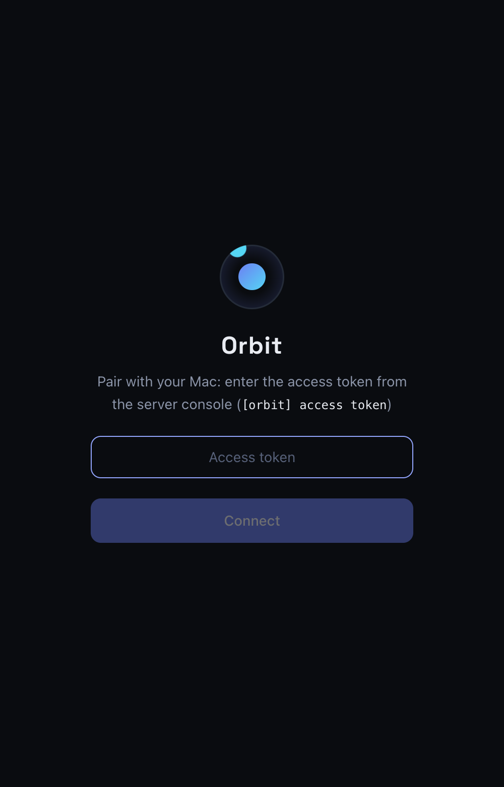
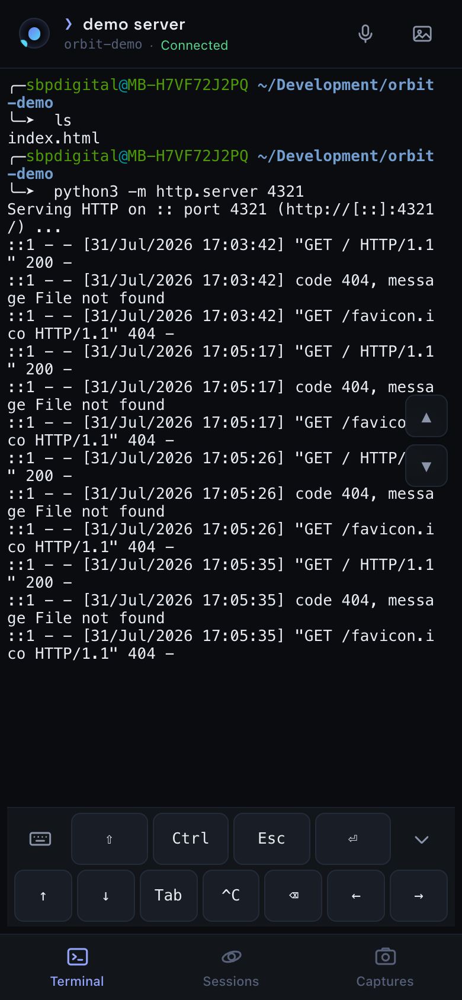
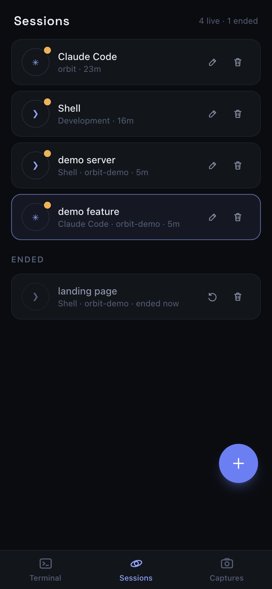
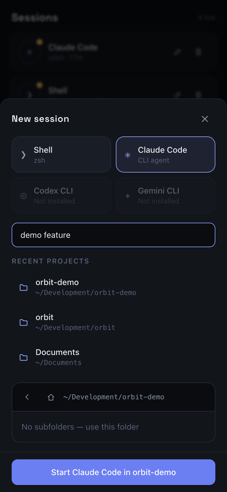
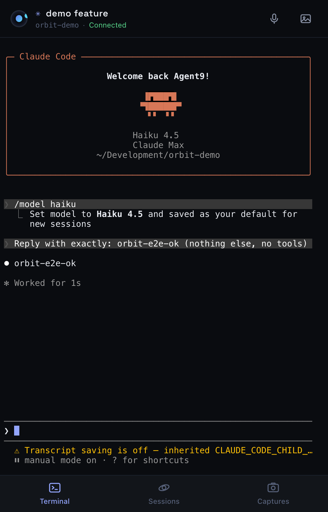
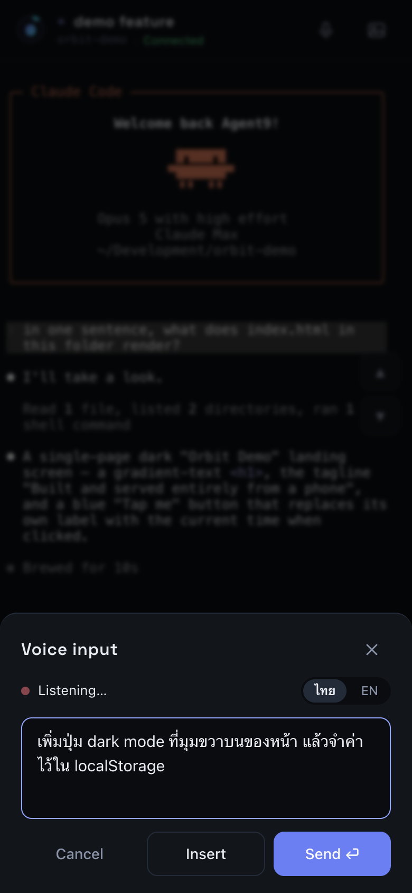
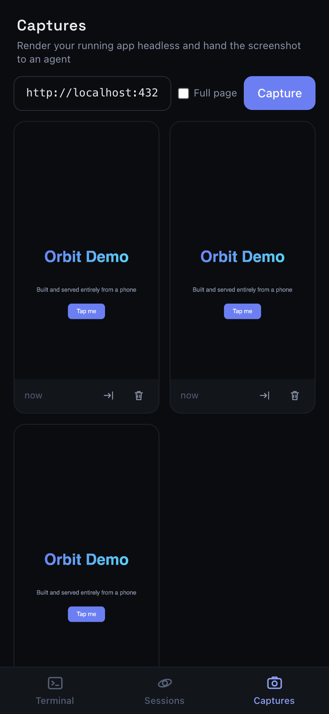
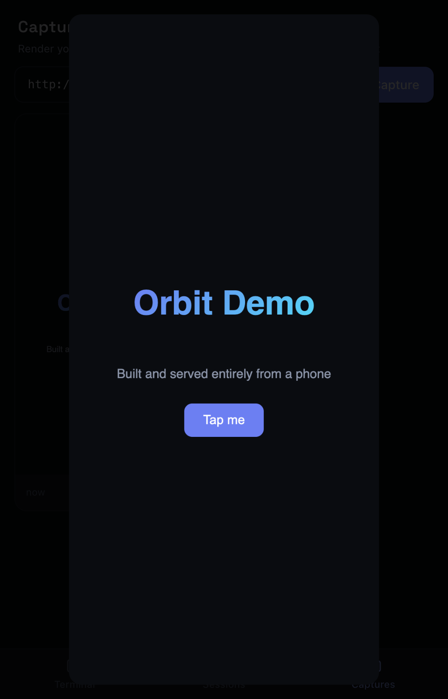
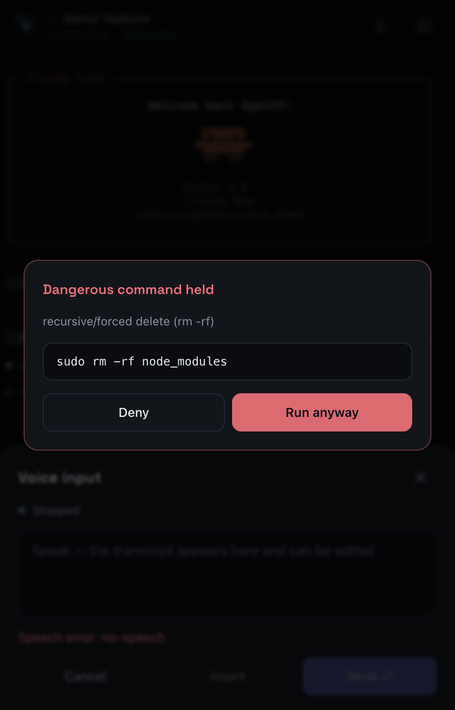
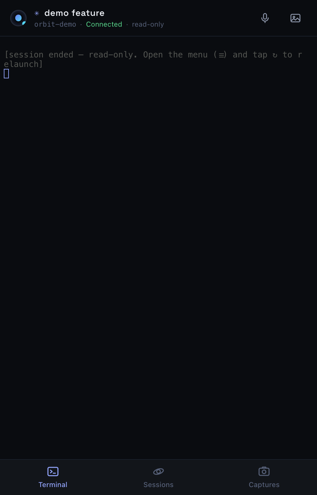

# คู่มือการใช้งาน Orbit

Orbit เปลี่ยน MacBook ของคุณเป็น AI development server ส่วนตัว — สั่งงาน Claude Code
จากมือถือได้เหมือนนั่งอยู่หน้าเครื่อง คู่มือนี้พาเดินครบทุกฟีเจอร์ด้วยตัวอย่างจริง:
สร้างเว็บเดโม่เล็ก ๆ รัน dev server ตรวจงานด้วย screenshot และคุยกับ Claude Code
ทั้งหมดจากหน้าจอมือถือ

> ภาพประกอบทั้งหมดถ่ายจากการใช้งานจริงบน viewport ขนาด iPhone (390×844)

## เริ่มต้น: จับคู่กับ Mac

รัน server บน Mac (`npm run build && npm start -w server`) แล้วเปิดจากมือถือ
ครั้งแรกจะเจอหน้า login ใส่ access token ที่ server พิมพ์ไว้ใน console
(`[orbit] access token: …`) ใส่ครั้งเดียว เครื่องจะจำไว้

เข้าได้ 2 ทาง:

| ทาง | URL | ข้อจำกัด |
|---|---|---|
| **HTTPS ผ่าน Tailscale** (แนะนำ) | `https://<เครื่อง>.<tailnet>.ts.net` | ใช้ได้ทุกฟีเจอร์ + เข้าจากนอกบ้านได้ ตั้งครั้งเดียวตาม [TAILSCALE.md](TAILSCALE.md) |
| LAN ธรรมดา | `http://<ip-ของ-mac>:3001` | ต้องอยู่ WiFi วงเดียวกัน และ **สั่งงานด้วยเสียงกับ Add to Home Screen จะใช้ไม่ได้** |

ที่เสียงใช้ไม่ได้บน HTTP เพราะเบราว์เซอร์ยอมให้ขอไมค์และลงทะเบียน service worker
เฉพาะบน secure context (HTTPS) เท่านั้น — ไม่ใช่ข้อจำกัดของ Orbit เอง

## แท็บ Terminal: shell จริงบนมือถือ

เข้ามาแล้วเจอ terminal ที่ต่อกับ zsh บน Mac ตรง ๆ — สี ANSI, prompt theme,
Ctrl+C, interactive TUI ทำงานครบ header บอกว่ากำลังอยู่ session ไหน
โฟลเดอร์อะไร สถานะเชื่อมต่อ (วงแหวน orbit หมุน = เชื่อมต่ออยู่)

ในภาพ: สร้างโปรเจกต์ `orbit-demo` เขียน `index.html` แล้วรัน
`python3 -m http.server 4321` — ทั้งหมดพิมพ์จากมือถือ

> 💡 **Session ไม่ตายเมื่อจอดับ** — ปิดเบราว์เซอร์ สลับแอป หรือเน็ตหลุด
> กลับมาแล้ว shell ยังรันต่ออยู่พร้อมประวัติครบ

## แท็บ Sessions: ศูนย์ควบคุม

เห็นทุก session ในที่เดียว — จุดสีเหลืองกระพริบ = กำลังรันอยู่
แต่ละแถวบอก agent, โฟลเดอร์, อายุ ตั้งชื่อ session ได้ (✎)
เพื่อแยกว่าตัวไหนทำงานอะไร เช่น "demo server" กับ "demo feature"

ไม่ตั้งชื่อก็ยังแยกออก — **คำสั่งแรกที่พิมพ์ในแต่ละ session จะกลายเป็นชื่อให้เอง**
(shell ใช้คำสั่ง, agent ใช้พรอมป์ตแรก) ขึ้นเป็นตัวหนังสือ monospace ให้รู้ว่าไม่ใช่ชื่อที่ตั้งเอง
พอตั้งชื่อทีหลังด้วย ✎ ชื่อที่ตั้งจะแทนที่ทันที

- **แตะแถว** — สลับไป session นั้น
- **✎** — เปลี่ยนชื่อ
- **🗑 (session ที่รันอยู่)** — หยุด ประวัติถูกเก็บไว้ในหมวด Ended
- **＋ (session ที่จบแล้ว)** — เริ่ม session ใหม่ด้วย agent + โฟลเดอร์ + ชื่อเดิม
- **🗑 (session ที่จบแล้ว)** — ลบถาวรพร้อมประวัติ

## สร้าง session ใหม่

กดปุ่ม **+** ในแท็บ Sessions:

1. **เลือก agent** — การ์ดจะจางถ้ายังไม่ได้ติดตั้ง CLI ตัวนั้น
2. **ตั้งชื่อ** (ไม่บังคับ แต่ช่วยมากเมื่อเปิดหลายตัว)
3. **เลือกโฟลเดอร์โปรเจกต์** — recent projects กดแตะเดียว หรือ browse เอง
   (โฟลเดอร์ที่เป็น git repo มีสัญลักษณ์ branch สีเขียว, ช่อง filter โผล่เมื่อ
   โฟลเดอร์เยอะ) ถ้าเผลอเลือกโฟลเดอร์กว้าง ๆ อย่าง home จะมีคำเตือนสีเหลือง
   แต่ไม่ห้าม

## ใช้ Claude Code จากมือถือ

เลือกการ์ด Claude Code + โฟลเดอร์โปรเจกต์ → ได้ Claude Code ตัวจริงรันบน Mac
ในภาพ: session "demo feature" ใน `orbit-demo` สลับโมเดลด้วย `/model haiku`
แล้วส่งพรอมป์ตทดสอบ — คำตอบกลับมาแสดงบนมือถือครบถ้วน

## สั่งงานด้วยเสียง 🎙

ปุ่มไมค์บน header ของ terminal → พูด → transcript ขึ้นสด **แก้ข้อความได้ก่อนส่ง**

> ⚠️ ต้องเข้าผ่าน **HTTPS** เท่านั้น ถ้าเปิดด้วย `http://<ip-ของ-mac>:3001`
> เบราว์เซอร์จะไม่ยอมให้ขอไมค์ ดู [TAILSCALE.md](TAILSCALE.md)

- **Insert** — พิมพ์ข้อความลง terminal เฉย ๆ (ตรวจก่อนกด Enter เอง)
- **Send ⏎** — พิมพ์แล้วส่งทันที

### บน iPhone ต้องรู้

iOS ไม่ได้ถอดเสียงในเครื่อง แต่ยิงไปที่ **บริการ dictation ของ Apple** —
เลยมีข้อจำกัดที่ Android/Chrome ไม่มี:

- **เลือกภาษาก่อนพูด** — ปุ่ม **ไทย / EN** มุมขวาบนของ sheet dictation ฟังทีละภาษา
  ตั้งเป็น EN แล้วพูดไทยจะได้ผลมั่ว สลับกลางคันได้ (มันเริ่มฟังใหม่ให้ ข้อความเดิมไม่หาย)
  แต่ **ไทยปนอังกฤษในประโยคเดียวไม่เวิร์ค** — ศัพท์เทคนิคอย่าง `npm run build`
  ให้พูดไทยส่วนที่เป็นคำสั่งงาน แล้วพิมพ์ส่วนที่เป็นโค้ดเอาเองในช่อง transcript
- **ฟังทีละช่วง** — พอเงียบสักพัก iOS จะปิด session เอง สถานะเปลี่ยนเป็น
  “Stopped” กด **Continue listening** พูดต่อได้ ข้อความเดิมไม่หาย (ต่อท้ายให้)
- **มีสวิตช์ 3 ตัวต้องเปิดครบ** — ปิดตัวไหนก็ขึ้น `service-not-allowed` เหมือนกันหมด
  แยกไม่ออกจาก error เลยต้องไล่เช็คทั้งสาม แล้ว **reload หน้าเว็บ** หลังแก้:
  1. Settings › Privacy & Security › **Speech Recognition** › Safari — เปิด
  2. Settings › General › Keyboard › **Enable Dictation** — เปิด
  3. ใน Safari กด **“AA”** ที่แถบ URL › Website Settings › **Microphone** › Allow

  (ถ้าเครื่องมี Screen Time เช็ค Content & Privacy › **Siri & Dictation** ด้วย)
- **ห้ามใช้จากไอคอน Home Screen** — WebKit บล็อก speech recognition ใน PWA
  แบบ standalone เปิดผ่าน Safari ปกติแทน
- **ต้องมีเน็ต** — dictation วิ่งผ่าน server ของ Apple ต่อ Tailscale อย่างเดียวไม่พอ

## ส่งภาพให้ agent 🖼

ปุ่มรูปภาพบน header → เลือกรูป/ถ่ายภาพ (เช่น screenshot ของ error หรือ
design ที่อยากได้) → ไฟล์ถูกอัปโหลดไปเก็บบน Mac แล้ว **path ถูกพิมพ์ลง
terminal ให้เลย** — พิมพ์ต่อว่าอยากให้ Claude ทำอะไรกับภาพนั้นได้ทันที

## แท็บ Captures: ตรวจงานด้วยตา

Agent แก้เว็บให้แล้ว — หน้าตาเป็นยังไง? ใส่ URL ของ dev server เลือกขนาดจอ
(**Phone / Tablet / Desktop** หรือติ๊ก Full page) แล้วกด **Capture**: Mac จะเปิด
Chrome แบบ headless render แล้วเก็บภาพไว้ในแกลเลอรีตามสัดส่วนจริงของภาพ

ถ้า dev server ไม่ได้รัน จะขึ้น error บอกตรง ๆ (ไม่ใช่เก็บภาพหน้า "เข้าไม่ได้"
ของ Chrome มาให้เหมือนสำเร็จ)

URL ที่ capture สำเร็จจะกลายเป็นปุ่มลัดใต้ช่อง (เก็บ 4 อันล่าสุด) — ไม่ต้องพิมพ์
`http://localhost:5173` ใหม่ทุกครั้งบนคีย์บอร์ดมือถือ และใต้ภาพแต่ละใบจะบอกว่า
เป็นภาพของอะไร (`localhost:5173`) ไม่ใช่มีแค่เวลา

ในภาพ: หน้าเว็บ `orbit-demo` ที่เพิ่งสร้างผ่าน terminal เมื่อครู่

แตะภาพเพื่อดูเต็มจอ / **⇥** แทรก path ของภาพลง terminal เพื่อส่งให้ agent
ดูต่อ ("ทำไมปุ่มเบี้ยว ดูจากภาพนี้") / **🗑** ลบ

### สลับเป็น Mac screen

กดสวิตช์ **Mac screen** แล้ว Capture = จับหน้าจอ Mac จริง ๆ ทั้งจอ ใช้ดูของที่
headless Chrome เห็นไม่ได้ — iOS Simulator, Xcode, แอป native, Figma

ต้องเปิดสิทธิ์ **Screen Recording** ให้แอปที่รัน Orbit server (Terminal / iTerm /
VS Code) ก่อน จุดที่หลอกคือถ้าไม่ได้เปิดสิทธิ์ macOS **จะไม่ error** แต่จะได้ภาพ
desktop เปล่า ๆ ที่ไม่มีหน้าต่างแอปเลย — เห็นแบบนั้นเมื่อไหร่ให้ไปเปิดสิทธิ์
ที่ System Settings → Privacy & Security → Screen & System Audio Recording

## ให้ agent ทำเองได้ (MCP)

ถ้าลง MCP server ของ Orbit ไว้ (ดู [MCP.md](MCP.md)) Claude จะ capture เองได้
โดยไม่ต้องรอคุณ — และ **เห็นภาพเองจริง ๆ** ไม่ใช่แค่ได้ path:

> "capture http://localhost:5173 แบบ desktop แล้วบอกว่า layout พังตรงไหน"

รูปที่ agent ถ่ายจะโผล่ในแท็บ Captures ของคุณด้วย นอกจากนั้น agent ยัง
**เตือนคุณขึ้นมือถือ** ตอนงานเสร็จ (`orbit_notify`) และ **ถามแล้วรอคำตอบ**
จากคุณกลางทางได้ (`orbit_ask`) — คำถามจะเด้งเป็นกล่องบนจอ กดเลือกแล้ว
agent ถึงจะเดินต่อ

## เกราะป้องกัน: Command Approval

Input ที่มาเป็นก้อน (วางข้อความ, สั่งด้วยเสียง) ถูกตรวจกับ pattern อันตราย
เช่น `rm -rf`, `sudo`, format disk, force push — ถ้าเจอ คำสั่งจะถูก**ยึดไว้ก่อน**
และถามยืนยันบนจอ พร้อมแสดงคำสั่งเต็ม ๆ ให้อ่าน

กด **Deny** = ทิ้งคำสั่ง ไม่มีอะไรถึง shell / **Run anyway** = ปล่อยผ่าน
(การพิมพ์สดทีละตัวอักษรไม่ถูกตรวจ — มือคุณ ความรับผิดชอบคุณ)

**ข้อควรรู้:** ด่านนี้ดูเฉพาะสิ่งที่ **คุณ** ส่งเข้า terminal เท่านั้น คำสั่งที่ **agent
รันเอง** ผ่าน Bash tool ของมันไม่ผ่านด่านนี้เลย ถ้าอยากให้ครอบคลุมด้วย ให้ติดตั้ง
hook `orbit-approve` ตาม [MCP.md](MCP.md) — คำสั่งอันตรายของ agent จะเด้งมาถาม
บนมือถือเหมือนกัน และ agent จะหยุดรอจนกว่าคุณจะกด

## ประวัติไม่หาย: Ended sessions

Session ที่จบแล้ว (agent ออกเอง, กดหยุด, หรือ server restart) ยังเปิดดูได้ —
terminal แสดงประวัติทั้งหมดแบบ **read-only** พร้อมป้ายบอกใน header
แถบคีย์ลัดจะซ่อนไปเอง (ไม่มี PTY ให้ส่งอะไรแล้ว) เลื่อนดูประวัติได้ตามปกติ

อยากทำงานต่อ มีสองปุ่มที่มุมขวาบนของ terminal:

- **↻ Resume** — ให้ agent **สานบทสนทนาล่าสุดของโฟลเดอร์นั้นต่อ** (Claude Code ใช้
  `claude --continue`, Codex ใช้ `codex resume --last`) ถ้าโฟลเดอร์นั้นไม่เคยคุยกัน
  มาก่อน agent จะบอกเองใน terminal ว่าไม่มีบทสนทนาให้ต่อ

  ปุ่มนี้ขึ้น **เฉพาะ session ที่จบล่าสุดของโฟลเดอร์+agent นั้น และต้องไม่มี session
  ไหนของโฟลเดอร์นั้นรันค้างอยู่** เพราะคำสั่งพวกนี้รู้จักแค่ "โฟลเดอร์" ไม่รู้จัก
  session ของ Orbit — กดจากรายการเก่าก็จะได้บทสนทนาล่าสุดอยู่ดี (ไม่ใช่อันที่กด)
  และถ้าโฟลเดอร์นั้นมี agent ทำงานอยู่ จะกลายเป็น agent สองตัวจับบทสนทนาเดียวกัน
  Shell กับ Gemini ไม่มีปุ่มนี้เลยเพราะไม่มีคำสั่งให้ต่อ
- **＋ New** — เริ่มใหม่หมด ใช้ agent + โฟลเดอร์ + ชื่อเดิม แต่ไม่เอาบทสนทนาเก่ามา

ในแท็บ Sessions แถวของ session ที่จบแล้วก็มี ↻ กับ ＋ เหมือนกัน

## ติดตั้งเป็นแอป (PWA)

เปิดผ่าน HTTPS (ดู [TAILSCALE.md](TAILSCALE.md)) แล้ว **Add to Home Screen**
— ได้ไอคอน Orbit บนหน้าจอ เปิดเต็มจอไม่มีแถบเบราว์เซอร์

## สรุป flow ที่ใช้บ่อย

| อยากทำ | ทำยังไง |
|---|---|
| สั่ง Claude แก้โค้ดโปรเจกต์ X | Sessions → + → Claude Code → เลือก X → Start |
| ดูว่าเมื่อกี้ agent ทำอะไรไป | Sessions → แตะ session (จบแล้วก็เปิดดูได้) |
| ตรวจหน้าเว็บหลัง agent แก้ | Captures → ใส่ URL → เลือกขนาดจอ → Capture |
| ดู Simulator / แอป native บน Mac | Captures → Mac screen → Capture |
| ให้ agent ตรวจงานตัวเองด้วยภาพ | ลง MCP ([MCP.md](MCP.md)) แล้วสั่ง "capture … แล้วดูให้หน่อย" |
| ส่ง error screenshot ให้ agent | Terminal → 🖼 → เลือกรูป → พิมพ์คำสั่งต่อท้าย path |
| สั่งงานยาว ๆ ไม่อยากพิมพ์ | Terminal → 🎙 → พูด → แก้ transcript → Send |
| เปลี่ยนชื่อ session | Sessions → ✎ |
| หยุดทุกอย่างชั่วคราว | ปิดเบราว์เซอร์ไปเลย — ทุก session รอต่ออยู่บน Mac |
